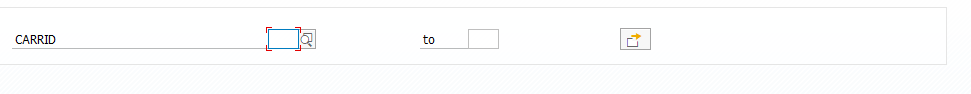
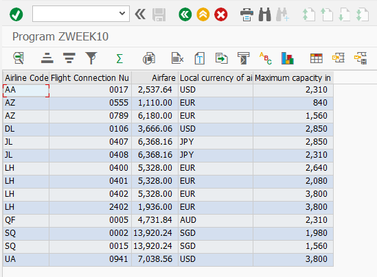

```abap
*&---------------------------------------------------------------------*
*& Report ZWEEK10
*&---------------------------------------------------------------------*
*&
*&---------------------------------------------------------------------*
REPORT zweek10.


TABLES:     sflight.  " 데이터베이스에 있는 sflight 테이블을 사용하겠다.

TYPE-POOLS: slis.     " slis 구조를 가져다 쓰겠다.

*Data Declaration
*--------------------
TYPES: BEGIN OF t_sflight,
         carrid   TYPE sflight-carrid,      " 항공사 코드 (CHAR 3 - AA, AZ)
         connid   TYPE sflight-connid,      " 항공편 노선 (NUMC 4 - 0018)
         price    TYPE sflight-price,       " 항공편 금액 (CURR 15 - 185.00)
         currency TYPE sflight-currency,    " 통화단위   (CUKY 5 - USD)
         seatsmax TYPE sflight-seatsmax,    " 이코노미석의 최대 좌석 수  (INT4 10 - 385)
       END OF t_sflight.


* it_sflight : TABLE OF를 사용해서 STANDARD 테이블을 선언한다.
* wa_sflight : t_sflight 구조를 가지고 행을 선언한다 (구조를 복사해서 쓴다)
DATA: it_sflight TYPE STANDARD TABLE OF t_sflight INITIAL SIZE 0,
      wa_sflight TYPE t_sflight.

DATA: it_collect TYPE STANDARD TABLE OF t_sflight INITIAL SIZE 0,
      wa_collect TYPE t_sflight.

*ALV data declarations
DATA: fieldcatalog TYPE slis_t_fieldcat_alv WITH HEADER LINE,
      gd_tab_group TYPE slis_t_sp_group_alv,
      gd_layout    TYPE slis_layout_alv,
      gd_repid     LIKE sy-repid.


SELECTION-SCREEN BEGIN OF BLOCK part1 WITH FRAME TITLE TEXT-001.
SELECT-OPTIONS s_carrid FOR sflight-carrid.
SELECTION-SCREEN END OF BLOCK part1.


*Start-of-selection.
START-OF-SELECTION.
  PERFORM data_retrieval.
  PERFORM build_fieldcatalog.
  PERFORM build_layout.         " ALV 리포트의 레이아웃을 정의
  PERFORM display_alv_report.


*&---------------------------------------------------------------------*
*&      Form  BUILD_LAYOUT
*&---------------------------------------------------------------------*
*       Build layout for ALV grid report
*----------------------------------------------------------------------*
FORM build_layout.
  gd_layout-no_input  = 'X'.
  gd_layout-colwidth_optimize = 'X'.
  gd_layout-zebra = 'X'.
ENDFORM.


*&---------------------------------------------------------------------*
*&      Form  DISPLAY_ALV_REPORT
*&---------------------------------------------------------------------*
*       Display report using ALV grid
*----------------------------------------------------------------------*
FORM display_alv_report.
  gd_repid = sy-repid.
  CALL FUNCTION 'REUSE_ALV_GRID_DISPLAY'
    EXPORTING
      i_callback_program = gd_repid
      is_layout          = gd_layout
      it_fieldcat        = fieldcatalog[]
      i_save             = 'X'
    TABLES
      t_outtab           = it_collect
    EXCEPTIONS
      program_error      = 1
      OTHERS             = 2.
  IF sy-subrc <> 0.
* MESSAGE ID SY-MSGID TYPE SY-MSGTY NUMBER SY-MSGNO
*         WITH SY-MSGV1 SY-MSGV2 SY-MSGV3 SY-MSGV4.
  ENDIF.


ENDFORM.                    " DISPLAY_ALV_REPORT


*&---------------------------------------------------------------------*
*&      Form  BUILD_FIELDCATALOG
*&---------------------------------------------------------------------*
*       Build Fieldcatalog for ALV Report
*----------------------------------------------------------------------*
FORM build_fieldcatalog.

  fieldcatalog-fieldname   = 'CARRID'.
  fieldcatalog-seltext_m   = 'Airline Code'.
  fieldcatalog-col_pos     = 0.
  fieldcatalog-lzero       = 'X'.
  APPEND fieldcatalog TO fieldcatalog.
  CLEAR  fieldcatalog.

  fieldcatalog-fieldname   = 'CONNID'.
  fieldcatalog-seltext_m   = 'Flight Connection Number'.
  fieldcatalog-col_pos     = 1.
  fieldcatalog-lzero       = 'X'.
  APPEND fieldcatalog TO fieldcatalog.
  CLEAR fieldcatalog.

  fieldcatalog-fieldname   = 'PRICE'.
  fieldcatalog-seltext_m   = 'Airfare'.
  fieldcatalog-col_pos     = 2.
  APPEND fieldcatalog TO fieldcatalog.
  CLEAR fieldcatalog.

  fieldcatalog-fieldname   = 'CURRENCY'.
  fieldcatalog-seltext_m   = 'Local currency of airline'.
  fieldcatalog-col_pos     = 3.
  APPEND fieldcatalog TO fieldcatalog.
  CLEAR fieldcatalog.

  fieldcatalog-fieldname   = 'SEATSMAX'.
  fieldcatalog-seltext_m   = 'Maximum capacity in economy class'.
  fieldcatalog-col_pos     = 4.
  APPEND fieldcatalog TO fieldcatalog.
  CLEAR fieldcatalog.

ENDFORM.                    " BUILD_FIELDCATALOG

*&---------------------------------------------------------------------*
*&      Form  DATA_RETRIEVAL
*&---------------------------------------------------------------------*
*       Retrieve data form sflight table and populate itab sflight
*----------------------------------------------------------------------*
FORM data_retrieval.

  SELECT carrid connid price currency seatsmax
    FROM sflight
    INTO TABLE it_sflight
   WHERE carrid IN s_carrid.

   LOOP AT it_sflight INTO wa_sflight.
     COLLECT wa_sflight INTO it_collect.
   ENDLOOP.

ENDFORM.                    " DATA_RETRIEVAL
```



