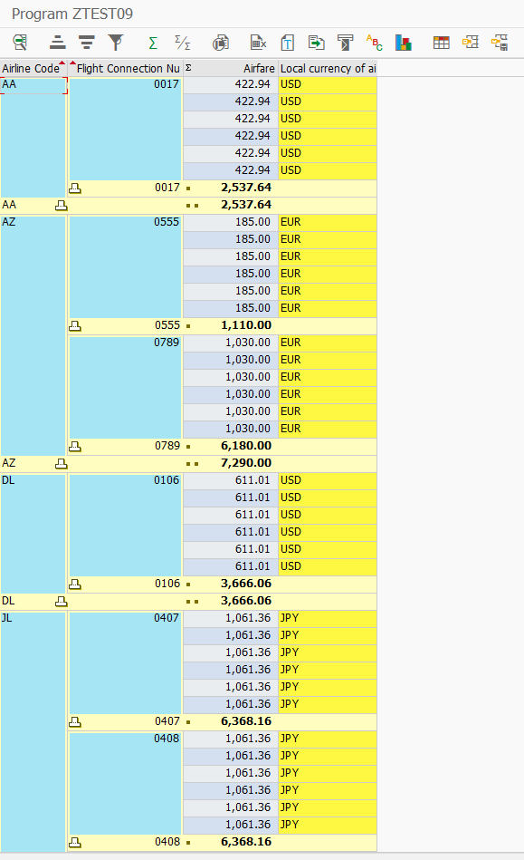

### 4주차 과제

```abap
*&---------------------------------------------------------------------*
*& Report ZTEST12
*&---------------------------------------------------------------------*
*&
*&---------------------------------------------------------------------*
REPORT ZTEST12.


TABLES:   sflight.

TYPE-POOLS: slis.


TYPES: BEGIN OF t_sflight,
  carrid    TYPE sflight-carrid,
  connid    TYPE sflight-connid,
  price     TYPE sflight-price,
  currency  TYPE sflight-currency,
  END OF t_sflight.


DATA: it_sflight TYPE STANDARD TABLE OF t_sflight INITIAL SIZE 0,
      wa_sflight TYPE t_sflight,
      it_sort TYPE slis_t_sortinfo_alv,
      ls_sort TYPE slis_sortinfo_alv.


DATA: fieldcatalog TYPE slis_t_fieldcat_alv WITH HEADER LINE,
      gd_tab_group TYPE slis_t_sp_group_alv,
      gd_layout    TYPE slis_layout_alv,
      gd_repid     LIKE sy-repid.


START-OF-SELECTION.
  PERFORM data_retrieval.
  PERFORM build_fieldcatalog.
  PERFORM build_layout.
  PERFORM build_sort.
  PERFORM display_alv_report.


*&---------------------------------------------------------------------*
*&      Form  BUILD_FIELDCATALOG
*&---------------------------------------------------------------------*
*       Build Fieldcatalog for ALV Report
*----------------------------------------------------------------------*
FORM build_fieldcatalog.
  fieldcatalog-fieldname = 'CARRID'.
  fieldcatalog-seltext_m = 'Airline Code'.
  fieldcatalog-col_pos   = 0.
  fieldcatalog-key       = 'X'.
  APPEND fieldcatalog TO fieldcatalog.
  CLEAR  fieldcatalog.

  fieldcatalog-fieldname   = 'CONNID'.
  fieldcatalog-seltext_m   = 'Flight Connection Number'.
  fieldcatalog-col_pos     = 1.
  fieldcatalog-key         = 'X'.
  fieldcatalog-lzero       = 'X'.
  APPEND fieldcatalog TO fieldcatalog.
  CLEAR fieldcatalog.

  fieldcatalog-fieldname   = 'PRICE'.
  fieldcatalog-seltext_m   = 'Airfare'.
  fieldcatalog-col_pos     = 2.
  fieldcatalog-do_sum      = 'X'.
  APPEND fieldcatalog TO fieldcatalog.
  CLEAR fieldcatalog.

  fieldcatalog-fieldname   = 'CURRENCY'.
  fieldcatalog-seltext_m   = 'Local currency of airline'.
  fieldcatalog-col_pos     = 3.
  fieldcatalog-emphasize   = 'C310'.
  APPEND fieldcatalog TO fieldcatalog.
  CLEAR fieldcatalog.

ENDFORM.

*&---------------------------------------------------------------------*
*&      Form  BUILD_LAYOUT
*&---------------------------------------------------------------------*
*       Build layout for ALV grid report
*----------------------------------------------------------------------*
FORM build_layout.
  gd_layout-no_input  = 'X'.
  gd_layout-colwidth_optimize = 'X'.
  gd_layout-zebra = 'X'.
ENDFORM.

*&---------------------------------------------------------------------*
*&      Form  DISPLAY_ALV_REPORT
*&---------------------------------------------------------------------*
*       Display report using ALV grid
*----------------------------------------------------------------------*
FORM display_alv_report.
  gd_repid = sy-repid.
  CALL FUNCTION 'REUSE_ALV_GRID_DISPLAY'
    EXPORTING
      i_callback_program = gd_repid
      is_layout          = gd_layout
      it_fieldcat        = fieldcatalog[]
      it_sort            = it_sort
      i_save             = 'X'
    TABLES
      t_outtab           = it_sflight
    EXCEPTIONS
      program_error      = 1
      OTHERS             = 2.
  IF sy-subrc <> 0.
* MESSAGE ID SY-MSGID TYPE SY-MSGTY NUMBER SY-MSGNO
*         WITH SY-MSGV1 SY-MSGV2 SY-MSGV3 SY-MSGV4.
  ENDIF.

ENDFORM.                    " DISPLAY_ALV_REPORT

*&---------------------------------------------------------------------*
*&      Form  DATA_RETRIEVAL
*&---------------------------------------------------------------------*
*       Retrieve data form sflight table and populate itab it_sflight
*----------------------------------------------------------------------*
FORM data_retrieval.
  SELECT carrid connid price currency
    FROM sflight
    INTO TABLE it_sflight.
ENDFORM.

*&---------------------------------------------------------------------*
*& Form BUILD_SORT
*&---------------------------------------------------------------------*
*& text
*&---------------------------------------------------------------------*
*& -->  p1        text
*& <--  p2        text
*&---------------------------------------------------------------------*

FORM build_sort .
  ls_sort-spos = 1.
  ls_sort-fieldname = 'CARRID'.
  ls_sort-up = 'X'.
  ls_sort-subtot = 'X'.
  APPEND ls_sort TO it_sort.
  CLEAR ls_sort.

  ls_sort-spos = 2.
  ls_sort-fieldname = 'CONNID'.
  ls_sort-up = 'X'.
  ls_sort-subtot = 'X'.
  APPEND ls_sort TO it_sort.
  CLEAR ls_sort.

ENDFORM.
```


