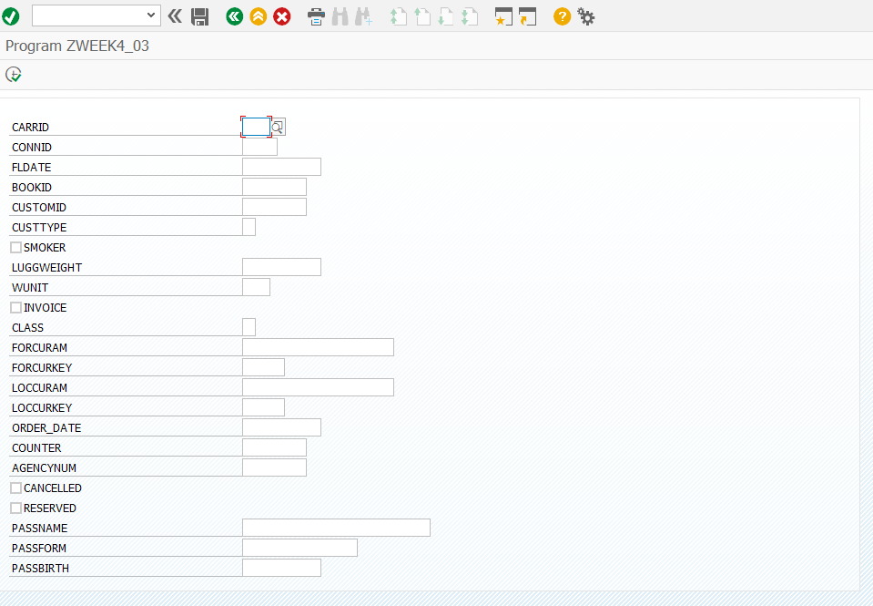

```abap
*&---------------------------------------------------------------------*
*& Report ZWEEK4_03
*&---------------------------------------------------------------------*
*&
*&---------------------------------------------------------------------*
REPORT ZWEEK4_03.


SELECTION-SCREEN BEGIN OF BLOCK part1 WITH FRAME TITLE text-001.
  PARAMETERS: p01 TYPE sbook-carrid,      " 항공사 코드(Airline Code). AA, AZ
              p02 TYPE sbook-connid,      " 항공편 번호(Flight Connection No.) 0018, 0400
              p03 TYPE sbook-fldate,      " 운항 날짜(Flight Date)
              p04 TYPE sbook-bookid,      " 예약 번호(Booking Number
              p05 TYPE sbook-customid,    " 고객 번호(Customer Number): 예약을 한 고객의 번호
              p06 TYPE sbook-custtype,    " 고객 유형(Customer Type): 고객의 유형을 나타냅니다. B, C
              p07 TYPE sbook-smoker,      " 흡연 여부(Smoker): 흡연석을 선호하는지 나타내는 플래그(Flag) X는 흡연, 공백은 비흡연
              p08 TYPE sbook-luggweight,  " 수하물 무게(Luggage Weight) QUAN은 수량 데이터 타입으로, 항상 옆의 단위 필드와 짝
              p09 TYPE sbook-wunit,       " 무게 단위(Weight Unit) KG, LB
              p10 TYPE sbook-invoice,     " 청구서 플래그(Invoice Flag)
              p11 TYPE sbook-class,       " 좌석 등급(Flight Class) 예약된 좌석의 등급. Y(이코노미), C(비즈니스), F(퍼스트)
              p12 TYPE sbook-forcuram,    " 외화 가격(Foreign Currency Amount) 예약 가격(외화)
              p13 TYPE sbook-forcurkey,   " 외화 키(Foreign Currency Key) 외화 가격의 통화 단위. USD, EUR
              p14 TYPE sbook-loccuram,    " 자국 통화 가격(Local Currency Amount) 예약 가격(자국 통화)
              p15 TYPE sbook-loccurkey,   " 자국 통화 키(Local Currency Key) 자국 통화의 단위
              p16 TYPE sbook-order_date,  " 예약 날짜(Booking Date) 예약이 이루어진 날짜
              p17 TYPE sbook-counter,     " 판매 사무소 번호(Sales Office No.) 예약이 접수된 판매 사무소 번호
              p18 TYPE sbook-agencynum,   " 여행사 번호(Travel Agency No.) 예약을 진행한 여행사 번호
              p19 TYPE sbook-cancelled,   "  취소 플래그(Cancellation Flag)
              p20 TYPE sbook-reserved,    "  예약 플래그(Reservation Flag)
              p21 TYPE sbook-passname,    " 승객 이름(Name of the Passenger)
              p22 TYPE sbook-passform,    " 승객 호칭(Form of address)
              p23 TYPE sbook-passbirth.   " 승객 생년월일(Date of Birth)
SELECTION-SCREEN END OF BLOCK part1.
```

