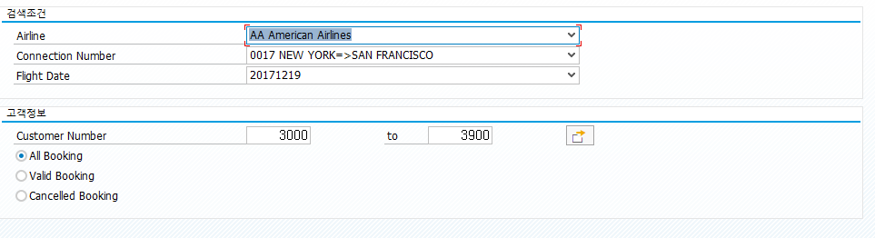

```abap
*&---------------------------------------------------------------------*
*& Report ZTEST19_12
*&---------------------------------------------------------------------*
*&
*&---------------------------------------------------------------------*
REPORT ZTEST19_12.


TABLES:     sbook.

TYPE-POOLS: slis.
TYPE-POOLS: VRM.                       " 리스트박스를 구현하기 위해 필요한 구조들이 있다.

TYPES: BEGIN OF t_sbook,
    carrid     TYPE sbook-carrid,      " 항공사 코드. AA(아메리칸 항공)
    connid     TYPE sbook-connid,      " 항공편 연결 번호
    fldate     TYPE sbook-fldate,      " 비행 날짜. 'YYYY.MM.DD'
    bookid     TYPE sbook-bookid,      " 예약 번호
    customid   TYPE sbook-customid,    " 고객 번호
    loccuram   TYPE sbook-loccuram,    " 항공사의 현지 통화로 책정된 예약 가격
    loccurkey  TYPE sbook-loccurkey,   " 항공사 현지 통화 코드
    order_date TYPE sbook-order_date,  " 예약 날짜
    cancelled  TYPE sbook-cancelled,   " 취소
  END OF t_sbook.

DATA: it_sbook TYPE STANDARD TABLE OF t_sbook INITIAL SIZE 0.

DATA: fieldcatalog TYPE slis_t_fieldcat_alv WITH HEADER LINE,
      gd_tab_group TYPE slis_t_sp_group_alv,
      gd_layout    TYPE slis_layout_alv,
      gd_repid     LIKE sy-repid.


DATA: LT_DROPLIST TYPE VRM_VALUES.

*&---------------------------------------------------------------------*
SELECTION-SCREEN BEGIN OF BLOCK part1 WITH FRAME TITLE TEXT-001.
  PARAMETERS: s_carrid TYPE sbook-carrid
                       AS LISTBOX VISIBLE LENGTH 60
                       OBLIGATORY DEFAULT 'AA',

              s_connid TYPE sbook-connid
                       AS LISTBOX VISIBLE LENGTH 60
                       OBLIGATORY DEFAULT '0017',

              s_fldate TYPE sbook-fldate
                       AS LISTBOX VISIBLE LENGTH 60
                       OBLIGATORY DEFAULT '20171219'.

SELECTION-SCREEN END OF BLOCK part1.
*&---------------------------------------------------------------------*

*&---------------------------------------------------------------------*
SELECTION-SCREEN BEGIN OF BLOCK part2 WITH FRAME TITLE TEXT-002.
SELECT-OPTIONS s_cid FOR sbook-customid.

PARAMETERS: r1 RADIOBUTTON GROUP rad1 DEFAULT 'X',
            r2 RADIOBUTTON GROUP rad1,
            r3 RADIOBUTTON GROUP rad1.
SELECTION-SCREEN END OF BLOCK part2.

INITIALIZATION.
  s_cid-sign     = 'I'.
  s_cid-option   = 'EQ'.
  s_cid-low      = 3000.
  s_cid-high     = 3900.
  APPEND s_cid TO s_cid.
  CLEAR  s_cid.
*&---------------------------------------------------------------------*

*&---------------------------------------------------------------------*
" 리스트박스는 검색화면 출력되기 전에 실행된다.
AT SELECTION-SCREEN ON VALUE-REQUEST FOR s_carrid.    " 기존의 도움말을 수정

REFRESH LT_DROPLIST.                                  " 테이블을 비운다

SELECT
  CARRID AS KEY,                                      " KEY 라는 이름으로. CARRID의 값으로 40자리 문자 타입으로 들어간다.
  CARRID && ' ' && CARRNAME AS TEXT                   " TEXT 라는 이름으로. CARRID && ' ' && CARRNAME 이렇게 연결한 값이 80 자리 문자 타입으로 들어간다
  FROM SCARR
  INTO TABLE @LT_DROPLIST.

SORT LT_DROPLIST BY KEY TEXT.                         " 정렬. KEY TEXT 순서로 오름차순

DELETE ADJACENT DUPLICATES FROM LT_DROPLIST.          " 중복데이터는 제거

CALL FUNCTION 'VRM_SET_VALUES'
    EXPORTING
      id                    = 's_carrid'              " 리스트 박스를 만들어 줄 필드 이름. 여기에 KEY 값이 들어간다
      values                = LT_DROPLIST.            " 테이블로 받아온 값. p_carrid 에 KEY, TEXT 중에서 KEY를 넣는다.
*   EXCEPTIONS
*     ID_ILLEGAL_NAME       = 1
*     OTHERS                = 2
*            .
  IF sy-subrc = 0.
* Implement suitable error handling here
  ENDIF.
*&---------------------------------------------------------------------*

*&---------------------------------------------------------------------*
AT SELECTION-SCREEN ON VALUE-REQUEST FOR s_connid.

REFRESH LT_DROPLIST.

SELECT
  CONNID AS KEY,
  CONCAT( CONCAT( CAST( CONNID AS CHAR ) , ' ' ), ' ' && CITYFROM && '=>' && CITYTO ) AS TEXT
  FROM SPFLI
  INTO TABLE @LT_DROPLIST.

SORT LT_DROPLIST BY KEY TEXT.

DELETE ADJACENT DUPLICATES FROM LT_DROPLIST.

  CALL FUNCTION 'VRM_SET_VALUES'
    EXPORTING
      id                    = 's_connid'
      values                = LT_DROPLIST.
*   EXCEPTIONS
*     ID_ILLEGAL_NAME       = 1
*     OTHERS                = 2
*            .
  IF sy-subrc = 0.
* Implement suitable error handling here
  ENDIF.
*&---------------------------------------------------------------------*

*&---------------------------------------------------------------------*
AT SELECTION-SCREEN ON VALUE-REQUEST FOR s_fldate.

REFRESH LT_DROPLIST.

SELECT
  CAST( FLDATE AS CHAR ) AS KEY,
  CAST( FLDATE AS CHAR ) AS TEXT
  FROM SBOOK
  INTO TABLE @LT_DROPLIST.

SORT LT_DROPLIST BY KEY TEXT.

DELETE ADJACENT DUPLICATES FROM LT_DROPLIST.

  CALL FUNCTION 'VRM_SET_VALUES'
    EXPORTING
      id                    = 's_fldate'
      values                = LT_DROPLIST.
*   EXCEPTIONS
*     ID_ILLEGAL_NAME       = 1
*     OTHERS                = 2
*            .
  IF sy-subrc = 0.
* Implement suitable error handling here
  ENDIF.
*&---------------------------------------------------------------------*

*Start-of-selection.
START-OF-SELECTION.

  PERFORM data_retrieval.
  PERFORM build_fieldcatalog.
  PERFORM build_layout.
  PERFORM display_alv_report.

*&---------------------------------------------------------------------*
*&      Form  BUILD_FIELDCATALOG
*&---------------------------------------------------------------------*
*       Build Fieldcatalog for ALV Report
*----------------------------------------------------------------------*
FORM build_fieldcatalog.

  fieldcatalog-fieldname   = 'CARRID'.
  fieldcatalog-seltext_m   = 'Airline Code'.
  fieldcatalog-key          = 'X'.
  fieldcatalog-col_pos     = 0.
  fieldcatalog-outputlen   = 10.
  APPEND fieldcatalog TO fieldcatalog.
  CLEAR  fieldcatalog.

  fieldcatalog-fieldname   = 'CONNID'.
  fieldcatalog-seltext_m   = 'Flight Connection Number'.
  fieldcatalog-key         = 'X'.
  fieldcatalog-lzero       = 'X'.
  fieldcatalog-col_pos     = 1.
  APPEND fieldcatalog TO fieldcatalog.
  CLEAR  fieldcatalog.

  fieldcatalog-fieldname   = 'FLDATE'.
  fieldcatalog-seltext_m   = 'Flight date'.
  fieldcatalog-key         = 'X'.
  fieldcatalog-col_pos     = 2.
  APPEND fieldcatalog TO fieldcatalog.
  CLEAR  fieldcatalog.

  fieldcatalog-fieldname   = 'BOOKID'.
  fieldcatalog-seltext_m   = 'Booking number'.
  fieldcatalog-key         = 'X'.
  fieldcatalog-lzero       = 'X'.
  fieldcatalog-col_pos     = 3.
  APPEND fieldcatalog TO fieldcatalog.
  CLEAR  fieldcatalog.

  fieldcatalog-fieldname   = 'CUSTOMID'.
  fieldcatalog-seltext_m   = 'Customer Number'.
  fieldcatalog-lzero       = 'X'.
  fieldcatalog-hotspot     = 'X'.
  fieldcatalog-col_pos     = 4.
  APPEND fieldcatalog TO fieldcatalog.
  CLEAR  fieldcatalog.

  fieldcatalog-fieldname   = 'LOCCURAM'.
  fieldcatalog-seltext_m   = 'Price of booking in local currency of airline'.
  fieldcatalog-col_pos     = 5.
  APPEND fieldcatalog TO fieldcatalog.
  CLEAR  fieldcatalog.

  fieldcatalog-fieldname   = 'LOCCURKEY'.
  fieldcatalog-seltext_m   = 'Local currency of airline'.
  fieldcatalog-col_pos     = 6.
  APPEND fieldcatalog TO fieldcatalog.
  CLEAR  fieldcatalog.

  fieldcatalog-fieldname   = 'ORDER_DATE'.
  fieldcatalog-seltext_m   = 'Booking Date'.
  fieldcatalog-col_pos     = 7.
  APPEND fieldcatalog TO fieldcatalog.
  CLEAR  fieldcatalog.

  fieldcatalog-fieldname   = 'CANCELLED'.
  fieldcatalog-seltext_m   = 'Cancelation flag'.
  fieldcatalog-col_pos     = 8.
  APPEND fieldcatalog TO fieldcatalog.
  CLEAR  fieldcatalog.

ENDFORM.                    " BUILD_FIELDCATALOG

*&---------------------------------------------------------------------*
*&      Form  BUILD_LAYOUT
*&---------------------------------------------------------------------*
*       Build layout for ALV grid report
*----------------------------------------------------------------------*
FORM build_layout.

  gd_layout-no_input          = 'X'.
  gd_layout-colwidth_optimize = 'X'.
  gd_layout-zebra = 'X'.
*  gd_layout-info_fieldname =      'LINE_COLOR'.
*  gd_layout-def_status = 'A'.

ENDFORM.                    " BUILD_LAYOUT

*&---------------------------------------------------------------------*
*&      Form  DISPLAY_ALV_REPORT
*&---------------------------------------------------------------------*
*       Display report using ALV grid
*----------------------------------------------------------------------*
FORM display_alv_report.
  gd_repid = sy-repid.
  CALL FUNCTION 'REUSE_ALV_GRID_DISPLAY'
    EXPORTING
      i_callback_program = gd_repid
      is_layout          = gd_layout
      it_fieldcat        = fieldcatalog[]
      i_save             = 'X'
    TABLES
      t_outtab           = it_sbook
    EXCEPTIONS
      program_error      = 1
      OTHERS             = 2.
  IF sy-subrc <> 0.
* MESSAGE ID SY-MSGID TYPE SY-MSGTY NUMBER SY-MSGNO
*         WITH SY-MSGV1 SY-MSGV2 SY-MSGV3 SY-MSGV4.
  ENDIF.


ENDFORM.                    " DISPLAY_ALV_REPORT

*&---------------------------------------------------------------------*
*&      Form  DATA_RETRIEVAL
*&---------------------------------------------------------------------*
*       Retrieve data form SBOOK table and populate itab it_sbook
*----------------------------------------------------------------------*
FORM data_retrieval.
  DATA: ld_color(1) TYPE c.   " 로컬 변수. PERFORM 구문 안에서만 쓸 수 있다.

  IF r1 = 'X'.
    SELECT carrid connid fldate bookid customid loccuram loccurkey order_date cancelled
    FROM sbook
    INTO TABLE it_sbook
    WHERE customid IN s_cid
      AND carrid = s_carrid
      AND connid = s_connid
      AND fldate = s_fldate.
  ELSEIF r2 = 'X'.
    SELECT carrid connid fldate bookid customid loccuram loccurkey order_date cancelled
    FROM sbook
    INTO TABLE it_sbook
    WHERE customid IN s_cid
      AND carrid = s_carrid
      AND connid = s_connid
      AND fldate = s_fldate
      AND cancelled <> 'X'.
  ELSEIF r3 = 'X'.
    SELECT carrid connid fldate bookid customid loccuram loccurkey order_date cancelled
    FROM sbook
    INTO TABLE it_sbook
    WHERE customid IN s_cid
      AND carrid = s_carrid
      AND connid = s_connid
      AND fldate = s_fldate
      AND cancelled = 'X'.
  ENDIF.

ENDFORM.
```


