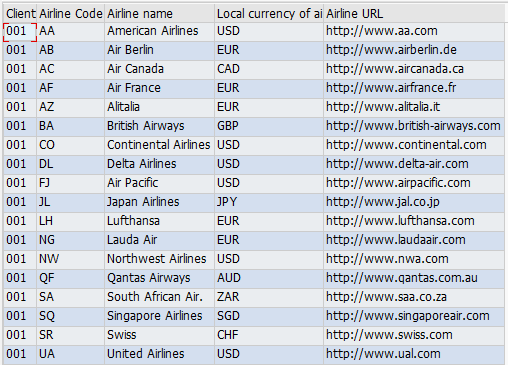

```abap
*&---------------------------------------------------------------------*
*& Report ZTEST05
*&---------------------------------------------------------------------*
*&
*&---------------------------------------------------------------------*
REPORT ZTEST05.

* 내가 이 테이블을 사용하겠다. 데이터베이스에 있는 scarr 테이블을 사용하겠다.
TABLES:     scarr.

* 타입그룹. 용도에 따라 타입이 모아져있다.
* ALV를 출력할 때 필요한 구조들이 묶여져있다.
* 이 프로그램은 slis 구조를 가져다 쓴거구나 라고 식별하기 위해서.
TYPE-POOLS: slis.                                 "ALV Declarations

*Data Declaration
*----------------
TYPES: BEGIN OF t_scarr,
  mandt    TYPE scarr-mandt,      " scarr 테이블의 mandt 필드의 구조(Type, 자리수)를 가져온다.
  carrid   TYPE scarr-carrid,     " 항공사 코드 (CHAR 3 - AA, AZ). 
  carrname TYPE scarr-carrname,   " 항공사 이름 (예: American Airlines, Lufthansa)
  currcode TYPE scarr-currcode,   " 해당 항공사의 현지 통화 코드 (예: USD)
  url      TYPE scarr-url,        " 항공사 홈페이지
 END OF t_scarr.

* TABLE OF : 테이블 선언(occurs 안쓰고 만들기)
* STANDARD TABLE OF 를 사용해서 t_scarr 테이블의 구조를 가져와서 it_scarr 테이블 선언.
DATA: it_scarr TYPE STANDARD TABLE OF t_scarr INITIAL SIZE 0,
      wa_scarr TYPE t_scarr.  " t_scarr 구조를 가지고 wa_scarr 행을 선언 (t_scarr 구조를 복사해서 쓴다)

"  STANDARD 95% 표준테이블 / 쓰기 가장 빠르다 읽기는 보통 / 키가 없어도 된다. TABLE OF 만해도 스탠다드 된다. STANDARD 생략가능
"  STORED    5% 정렬테이블 / 쓰기 가장 느리다 읽기 빠르다 / 키가 반듯이 있어야한다. 정렬기준이 있어야 하니깐 담으면 바로 정렬이된다.
"  HASHED  0.1% 가상의 키값을 가지고 빠르게 읽어올 수 있는 테이블 / 성능 개선을 위해 가끔 쓴다. / 키로 읽어오니 키를 선언해야한다.

"  INITIAL SIZE 초기 개수를 설정한다. 0으로 자동 메모리 할당. 0을 안써도 된다.


*ALV data declarations
DATA: fieldcatalog TYPE slis_t_fieldcat_alv WITH HEADER LINE,
      gd_tab_group TYPE slis_t_sp_group_alv,
      gd_layout    TYPE slis_layout_alv,
      gd_repid     LIKE sy-repid.

" WITH HEADER LINE은 행과 테이블 같이 선언된것. 헤더라인과 함께한다. 위에 행이 하나가 더 있다.
" 행과 테이블을 한 번에 만들어진것. 행 이름과 테이블이 이름이 같아서 헷갈리기도 한다.

DATA : t TYPE slis_t_sp_group_alv .
************************************************************************
*Start-of-selection.
START-OF-SELECTION.             " 실행버튼을 눌렀을 때 이벤트

  PERFORM data_retrieval.       " 실행 구문
  PERFORM build_fieldcatalog.
  PERFORM build_layout.
  PERFORM display_alv_report.


*&---------------------------------------------------------------------*
*&      Form  BUILD_FIELDCATALOG
*&---------------------------------------------------------------------*
*       Build Fieldcatalog for ALV Report
*----------------------------------------------------------------------*
FORM build_fieldcatalog.

  fieldcatalog-fieldname   = 'MANDT'.
  fieldcatalog-seltext_m   = 'Client'.
  fieldcatalog-col_pos     = 0.
  fieldcatalog-outputlen   = 10.
  APPEND fieldcatalog TO fieldcatalog.
  CLEAR  fieldcatalog.

  fieldcatalog-fieldname   = 'CARRID'.
  fieldcatalog-seltext_m   = 'Airline Code'.
  fieldcatalog-col_pos     = 1.
  APPEND fieldcatalog TO fieldcatalog.
  CLEAR  fieldcatalog.

  fieldcatalog-fieldname   = 'CARRNAME'.
  fieldcatalog-seltext_m   = 'Airline name'.
  fieldcatalog-col_pos     = 2.
  APPEND fieldcatalog TO fieldcatalog.
  CLEAR  fieldcatalog.

  fieldcatalog-fieldname   = 'CURRCODE'.
  fieldcatalog-seltext_m   = 'Local currency of airline'.
  fieldcatalog-col_pos     = 3.
  APPEND fieldcatalog TO fieldcatalog.
  CLEAR  fieldcatalog.

  fieldcatalog-fieldname   = 'URL'.
  fieldcatalog-seltext_m   = 'Airline URL'.
  fieldcatalog-col_pos     = 4.
  APPEND fieldcatalog TO fieldcatalog.
  CLEAR  fieldcatalog.

ENDFORM.                    " BUILD_FIELDCATALOG


*&---------------------------------------------------------------------*
*&      Form  BUILD_LAYOUT
*&---------------------------------------------------------------------*
*       Build layout for ALV grid report
*----------------------------------------------------------------------*
FORM build_layout.

  gd_layout-no_input          = 'X'.
  gd_layout-colwidth_optimize = 'X'.
  gd_layout-zebra = 'X'.
*  gd_layout-info_fieldname =      'LINE_COLOR'.
*  gd_layout-def_status = 'A'.

ENDFORM.                    " BUILD_LAYOUT


*&---------------------------------------------------------------------*
*&      Form  DISPLAY_ALV_REPORT
*&---------------------------------------------------------------------*
*       Display report using ALV grid
*----------------------------------------------------------------------*
FORM display_alv_report.
  gd_repid = sy-repid.
  CALL FUNCTION 'REUSE_ALV_GRID_DISPLAY'
    EXPORTING
      i_callback_program = gd_repid
      is_layout          = gd_layout
      it_fieldcat        = fieldcatalog[]
      i_save             = 'X'
    TABLES
      t_outtab           = it_scarr
    EXCEPTIONS
      program_error      = 1
      OTHERS             = 2.
  IF sy-subrc <> 0.
* MESSAGE ID SY-MSGID TYPE SY-MSGTY NUMBER SY-MSGNO
*         WITH SY-MSGV1 SY-MSGV2 SY-MSGV3 SY-MSGV4.
  ENDIF.


ENDFORM.                    " DISPLAY_ALV_REPORT


*&---------------------------------------------------------------------*
*&      Form  DATA_RETRIEVAL
*&---------------------------------------------------------------------*
*       Retrieve data form EKPO table and populate itab it_ekko
*----------------------------------------------------------------------*
FORM data_retrieval.
  DATA: ld_color(1) TYPE c.   " 로컬 변수. PERFORM 구문 안에서만 쓸 수 있다.

  SELECT mandt carrid carrname currcode url
*   UP TO 10 ROWS  "10줄 출력
    FROM scarr
    INTO TABLE it_scarr.

ENDFORM.                    " DATA_RETRIEVAL
```


