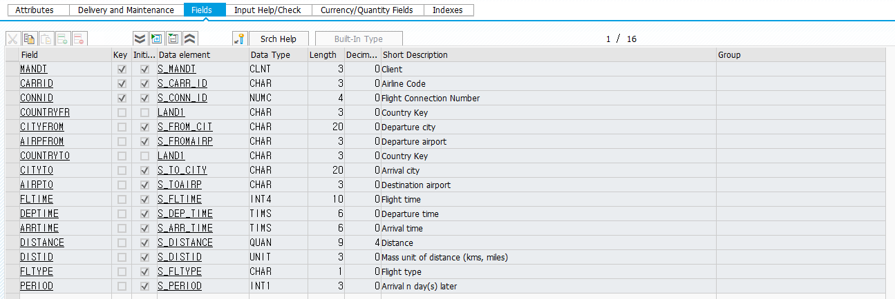
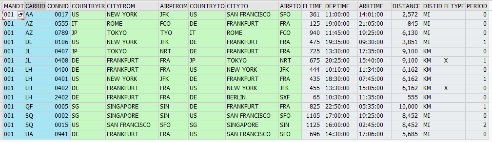
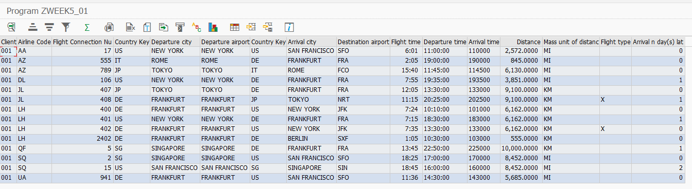

```abap
*&---------------------------------------------------------------------*
*& Report ZWEEK5_01
*&---------------------------------------------------------------------*
*&
*&---------------------------------------------------------------------*
REPORT ZWEEK5_01.

TABLES:     spfli.

TYPE-POOLS: slis.

* 데이터 정의
*-----------------------------------------------------------------------*
TYPES: BEGIN OF t_spfli,
  mandt     TYPE spfli-mandt,     " 클라이언트
  carrid    TYPE spfli-carrid,    " 항공사 코드(AA: American Airlines)
  connid    TYPE spfli-connid,    " 항공편 연결 번호
  countryfr TYPE spfli-countryfr, " 비행기가 출발하는 국가 코드
  cityfrom  TYPE spfli-cityfrom,  " 비행기가 출발하는 도시의 이름
  ariprfom  TYPE spfli-airpfrom,  " 비행기가 출발하는 공항의 코드(JFK - 뉴욕)
  countryto TYPE spfli-countryto, " 비행기가 도착하는 국가  코드
  cityto    TYPE spfli-cityto,    " 비행기가 도착하는 도시의 이름
  airpto    TYPE spfli-airpto,    " 비행기가 도착하는 공항의 코드
  fltime    TYPE spfli-fltime,    " 비행 시간(분)
  deptime   TYPE spfli-deptime,   " 출발시간
  arrtiem   TYPE spfli-arrtime,   " 도착시간
  distance  TYPE spfli-distance,  " 비행거리(출발지에서 도착지 까지 거리)
  distid    TYPE spfli-distid,    " 거리 단위(KM-킬로미터, MI-마일)
  fltype    TYPE spfli-fltype,    " 항공편 타입?
  period    TYPE spfli-period,    " 출발후 도착이 며칠 후에 이루어지는지(그날 도착:0, 다음날: 1, ... n)
END OF t_spfli.

DATA: it_spfli TYPE STANDARD TABLE OF t_spfli INITIAL SIZE 0,
      wa_spfli TYPE t_spfli.


*ALV data declarations
DATA: fieldcatalog TYPE slis_t_fieldcat_alv WITH HEADER LINE,
      gd_tab_group TYPE slis_t_sp_group_alv,
      gd_layout    TYPE slis_layout_alv,
      gd_repid     LIKE sy-repid.


DATA : t TYPE slis_t_sp_group_alv .
************************************************************************


*Start-of-selection. 실행했을 때
START-OF-SELECTION.

  PERFORM data_retrieval.
  PERFORM build_fieldcatalog.
  PERFORM build_layout.
  PERFORM display_alv_report.


*&---------------------------------------------------------------------*
*&      Form  BUILD_FIELDCATALOG
*&---------------------------------------------------------------------*
*       Build Fieldcatalog for ALV Report
*----------------------------------------------------------------------*
FORM build_fieldcatalog.

  fieldcatalog-fieldname   = 'MANDT'.
  fieldcatalog-seltext_m   = 'Client'.
  fieldcatalog-col_pos     = 0.
  APPEND fieldcatalog TO fieldcatalog.
  CLEAR  fieldcatalog.

  fieldcatalog-fieldname   = 'CARRID'.
  fieldcatalog-seltext_m   = 'Airline Code'.
  fieldcatalog-col_pos     = 1.
  APPEND fieldcatalog TO fieldcatalog.
  CLEAR  fieldcatalog.

  fieldcatalog-fieldname   = 'CONNID'.
  fieldcatalog-seltext_m   = 'Flight Connection Number'.
  fieldcatalog-col_pos     = 2.
  APPEND fieldcatalog TO fieldcatalog.
  CLEAR  fieldcatalog.

  fieldcatalog-fieldname   = 'COUNTRYFR'.
  fieldcatalog-seltext_m   = 'Country Key'.
  fieldcatalog-col_pos     = 3.
  APPEND fieldcatalog TO fieldcatalog.
  CLEAR  fieldcatalog.

  fieldcatalog-fieldname   = 'CITYFROM'.
  fieldcatalog-seltext_m   = 'Departure city'.
  fieldcatalog-col_pos     = 4.
  APPEND fieldcatalog TO fieldcatalog.
  CLEAR  fieldcatalog.

  fieldcatalog-fieldname   = 'AIRPFROM'.
  fieldcatalog-seltext_m   = 'Departure airport'.
  fieldcatalog-col_pos     = 5.
  APPEND fieldcatalog TO fieldcatalog.
  CLEAR  fieldcatalog.

  fieldcatalog-fieldname   = 'COUNTRYTO'.
  fieldcatalog-seltext_m   = 'Country Key'.
  fieldcatalog-col_pos     = 6.
  APPEND fieldcatalog TO fieldcatalog.
  CLEAR  fieldcatalog.

  fieldcatalog-fieldname   = 'CITYTO'.
  fieldcatalog-seltext_m   = 'Arrival city'.
  fieldcatalog-col_pos     = 7.
  APPEND fieldcatalog TO fieldcatalog.
  CLEAR  fieldcatalog.

  fieldcatalog-fieldname   = 'AIRPTO'.
  fieldcatalog-seltext_m   = 'Destination airport'.
  fieldcatalog-col_pos     = 8.
  APPEND fieldcatalog TO fieldcatalog.
  CLEAR  fieldcatalog.

  fieldcatalog-fieldname   = 'FLTIME'.
  fieldcatalog-seltext_m   = 'Flight time'.
  fieldcatalog-col_pos     = 9.
  APPEND fieldcatalog TO fieldcatalog.
  CLEAR  fieldcatalog.

  fieldcatalog-fieldname   = 'DEPTIME'.
  fieldcatalog-seltext_m   = 'Departure time'.
  fieldcatalog-col_pos     = 10.
  APPEND fieldcatalog TO fieldcatalog.
  CLEAR  fieldcatalog.

  fieldcatalog-fieldname   = 'ARRTIME'.
  fieldcatalog-seltext_m   = 'Arrival time'.
  fieldcatalog-col_pos     = 11.
  APPEND fieldcatalog TO fieldcatalog.
  CLEAR  fieldcatalog.

  fieldcatalog-fieldname   = 'DISTANCE'.
  fieldcatalog-seltext_m   = 'Distance'.
  fieldcatalog-col_pos     = 12.
  APPEND fieldcatalog TO fieldcatalog.
  CLEAR  fieldcatalog.

  fieldcatalog-fieldname   = 'DISTID'.
  fieldcatalog-seltext_m   = 'Mass unit of distance (kms, miles)'.
  fieldcatalog-col_pos     = 13.
  APPEND fieldcatalog TO fieldcatalog.
  CLEAR  fieldcatalog.

  fieldcatalog-fieldname   = 'FLTYPE'.
  fieldcatalog-seltext_m   = 'Flight type'.
  fieldcatalog-col_pos     = 14.
  APPEND fieldcatalog TO fieldcatalog.
  CLEAR  fieldcatalog.

  fieldcatalog-fieldname   = 'PERIOD'.
  fieldcatalog-seltext_m   = 'Arrival n day(s) later'.
  fieldcatalog-col_pos     = 15.
  APPEND fieldcatalog TO fieldcatalog.
  CLEAR  fieldcatalog.

ENDFORM.                    " BUILD_FIELDCATALOG


*&---------------------------------------------------------------------*
*&      Form  BUILD_LAYOUT
*&---------------------------------------------------------------------*
*       Build layout for ALV grid report
*----------------------------------------------------------------------*
FORM build_layout.

  gd_layout-no_input          = 'X'.
  gd_layout-colwidth_optimize = 'X'.
  gd_layout-zebra = 'X'.
*  gd_layout-info_fieldname =      'LINE_COLOR'.
*  gd_layout-def_status = 'A'.

ENDFORM.                    " BUILD_LAYOUT


*&---------------------------------------------------------------------*
*&      Form  DISPLAY_ALV_REPORT
*&---------------------------------------------------------------------*
*       Display report using ALV grid
*----------------------------------------------------------------------*
FORM display_alv_report.
  gd_repid = sy-repid.
  CALL FUNCTION 'REUSE_ALV_GRID_DISPLAY'
    EXPORTING
      i_callback_program = gd_repid
      is_layout          = gd_layout
      it_fieldcat        = fieldcatalog[]
      i_save             = 'X'
    TABLES
      t_outtab           = it_spfli
    EXCEPTIONS
      program_error      = 1
      OTHERS             = 2.
  IF sy-subrc <> 0.
* MESSAGE ID SY-MSGID TYPE SY-MSGTY NUMBER SY-MSGNO
*         WITH SY-MSGV1 SY-MSGV2 SY-MSGV3 SY-MSGV4.
  ENDIF.


ENDFORM.                    " DISPLAY_ALV_REPORT

*&---------------------------------------------------------------------*
*&      Form  DATA_RETRIEVAL
*&---------------------------------------------------------------------*
*       Retrieve data form SCARR table and populate itab it_scarr
*----------------------------------------------------------------------*
FORM data_retrieval.
  DATA: ld_color(1) TYPE c.

  SELECT mandt carrid connid countryfr cityfrom airpfrom countryto cityto airpto fltime deptime arrtime distance distid fltype period
*   UP TO 10 ROWS
    FROM spfli
    INTO TABLE it_spfli.

ENDFORM.

" 항공편 정보 마스터 데이터를 저장하는 SAP의 표준 테이블.
" 항공편 예약 시스템인 SAP NetWeaver Gateway 데모 시스템 등에서 사용됩니다.
" CARRID가 'AA'이고 CONNID가 '0017'인 항공편은 뉴욕에서 샌프란시스코로 가는 비행편이며, 거리는 2,572마일입니다.
```

 <br>
 <br>
 <br>

