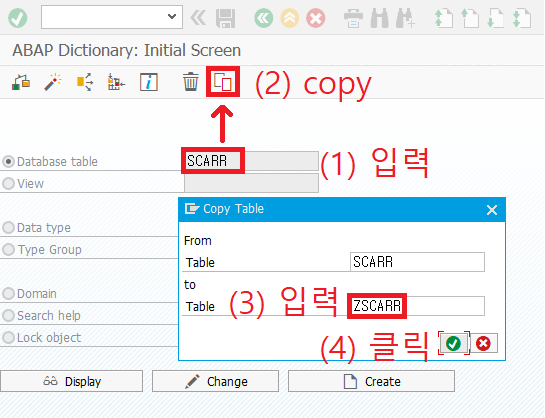
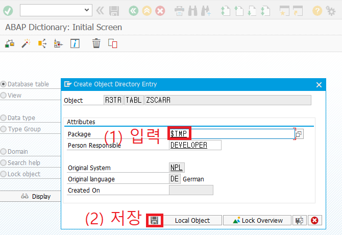
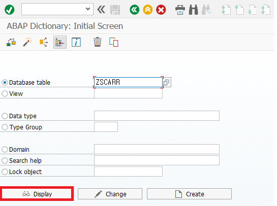
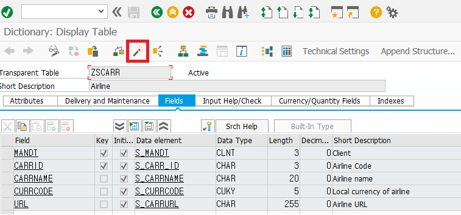
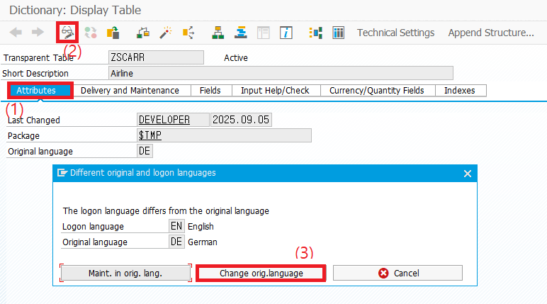
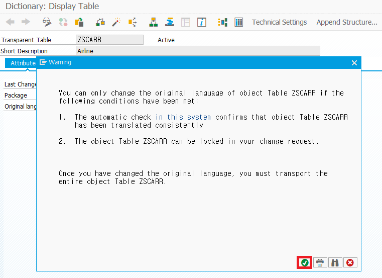
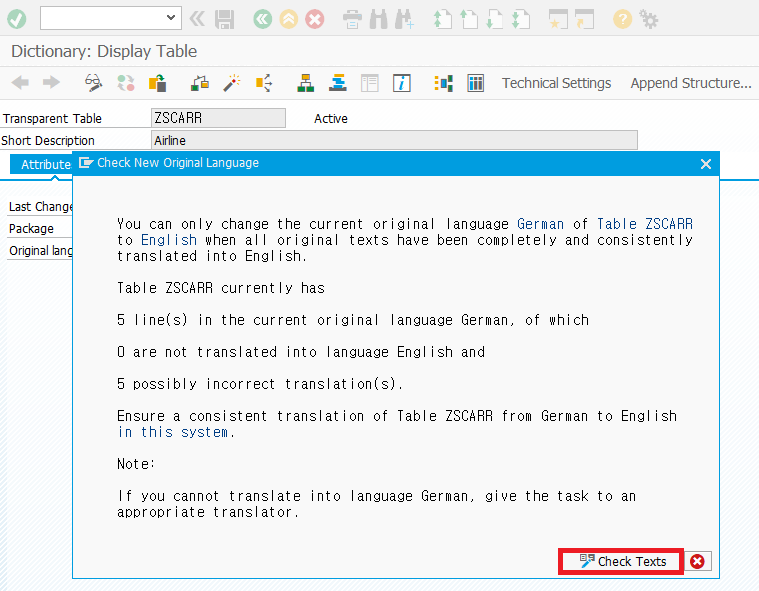
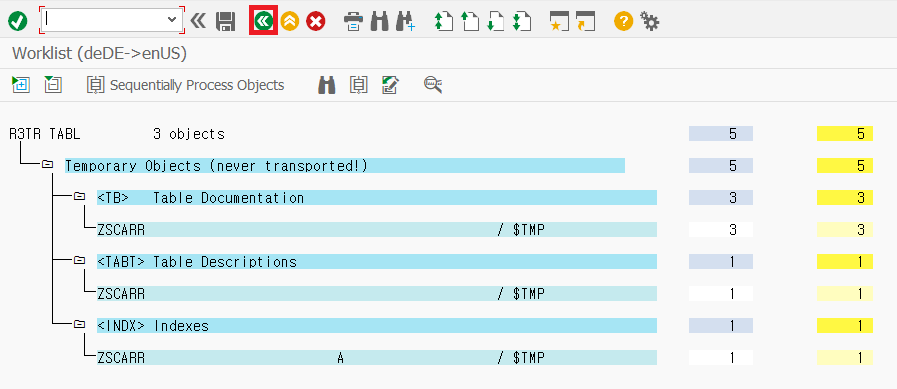
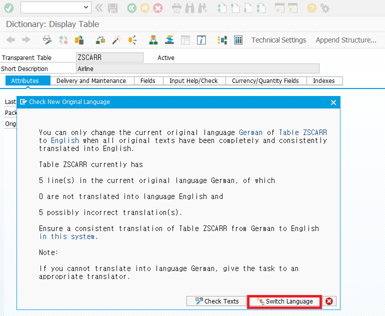
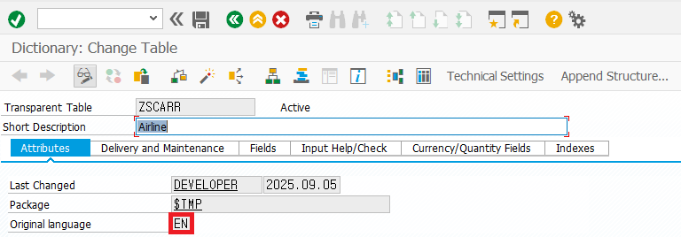

### function

### 1. 테이블 복사
  

### 2. 패키지 이름을 입력하고 저장
  

### 3. display를 클릭한다.
  

### 4. 클릭해서 활성화
  

### 5. 속성에서 안경 누르고 두 번째 클릭
  

### 6. 클릭
  

### 7. check text
  

### 8. 뒤로가기
  

### 9. switch language
  

### 10. en확인
  

  

