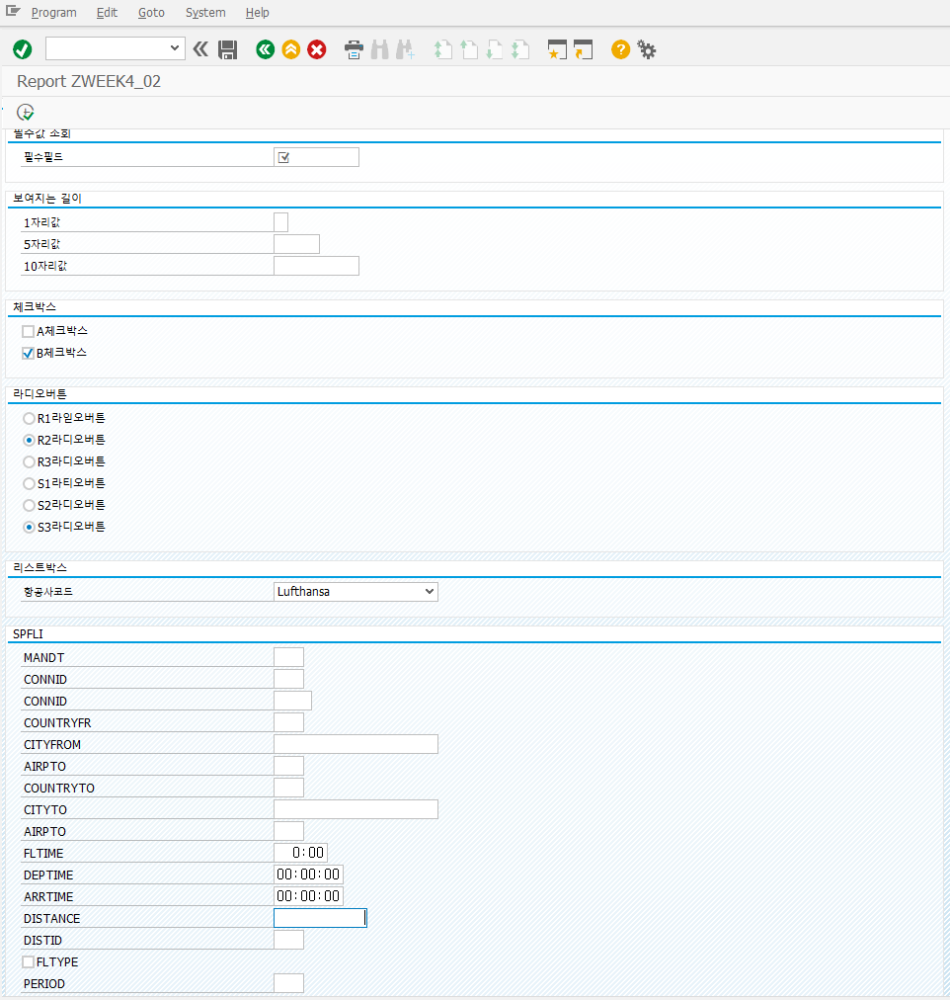

```abap
*&---------------------------------------------------------------------*
*& Report ZWEEK4_02
*&---------------------------------------------------------------------*
*&
*&---------------------------------------------------------------------*
REPORT ZWEEK4_02.


" WITH FRAME TITLE : 타이트을 넣어준다. Text Element에서 Text Symbols에 넣는다.
SELECTION-SCREEN BEGIN OF BLOCK part1 WITH FRAME TITLE text-001.
PARAMETERS field(10) TYPE c OBLIGATORY.
SELECTION-SCREEN END OF BLOCK part1.

SELECTION-SCREEN BEGIN OF BLOCK part2 WITH FRAME TITLE text-002.
  PARAMETERS: p1(10) TYPE c VISIBLE LENGTH 1,
              p2(10) TYPE c VISIBLE LENGTH 5,
              p3(10) TYPE c VISIBLE LENGTH 10.
SELECTION-SCREEN END OF BLOCK part2.

SELECTION-SCREEN BEGIN OF BLOCK part3 WITH FRAME TITLE text-003.
  PARAMETERS: a AS CHECKBOX USER-COMMAND flag,
              b AS CHECKBOX DEFAULT 'X' USER-COMMAND flag.
SELECTION-SCREEN END OF BLOCK part3.

SELECTION-SCREEN BEGIN OF BLOCK part4 WITH FRAME TITLE text-004.
  PARAMETERS: r1 RADIOBUTTON GROUP rad1,
              r2 RADIOBUTTON GROUP rad1 DEFAULT 'X',
              r3 RADIOBUTTON GROUP rad1,

              s1 RADIOBUTTON GROUP rad2,
              s2 RADIOBUTTON GROUP rad2,
              s3 RADIOBUTTON GROUP rad2 DEFAULT 'X'.
SELECTION-SCREEN END OF BLOCK part4.

SELECTION-SCREEN BEGIN OF BLOCK part5 WITH FRAME TITLE text-005.
  PARAMETERS: p_carrid TYPE spfli-carrid
                            AS LISTBOX VISIBLE LENGTH 20 DEFAULT 'LH'.
SELECTION-SCREEN END OF BLOCK part5.

SELECTION-SCREEN BEGIN OF BLOCK part6 WITH FRAME TITLE text-006.
  PARAMETERS: p01 TYPE spfli-mandt,     " 클라이언트
              p02 TYPE spfli-carrid,    " 항공사 코드(AA: American Airlines, DL: Delta)
              p03 TYPE spfli-connid,    " 항공편 번호
              p04 TYPE spfli-countryfr, " 출발 도시가 속한 국가 코드
              p05 TYPE spfli-cityfrom,  " 비행기가 출발하는 도시의 이름
              p06 TYPE spfli-airpfrom,  " 출발 공항(JFK-뉴욕)
              p07 TYPE spfli-countryto, " 도착 도시가 속한 국가 코드
              p08 TYPE spfli-cityto,    " 비행기가 도착하는 도시의 이름
              p09 TYPE spfli-airpto,    " 도착공항(SFO-샌프란시스코)
              p10 TYPE spfli-fltime,    " 비행에 소요되는 시간(분 단위)
              p11 TYPE spfli-deptime,   " 출발시간
              p12 TYPE spfli-arrtime,   " 도착시간
              p13 TYPE spfli-distance,  " 비행거리
              p14 TYPE spfli-distid ,   " 거리의 단위(KM-킬로미터, MI-마일)
              p15 TYPE spfli-fltype,    " 항공편 타입(항공편의 종류를 나타내는 한 자리 문자. X는 항공편 없음)
              p16 TYPE spfli-period.    " 도착일이 출발일과 얼마나 다른지를 나타냅니다. 0은 같은 날 도착, 1은 다음 날 도착

SELECTION-SCREEN END OF BLOCK part6.


START-OF-SELECTION.

WRITE: / field.

* abap selection screen example
* https://help.sap.com/doc/abapdocu_752_index_htm/7.52/en-US/abensel_screen_param_screen_abexa.htm
```

