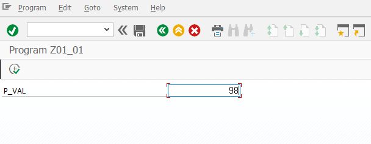
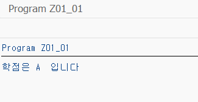

```abap
*&---------------------------------------------------------------------*
*& Report Z01_01
*&---------------------------------------------------------------------*
*&
*&---------------------------------------------------------------------*
REPORT Z01_01.


PARAMETERS: p_val TYPE i.

DATA: gv_grade TYPE c.

IF p_val = 100.
  gv_grade = 'A+'.
ELSEIF p_val >= 90.
  gv_grade = 'A'.
ELSEIF p_val >= 80.
  gv_grade = 'B'.
ELSE.
  gv_grade = 'C'.
ENDIF.

WRITE: '학점은', gv_grade, ' 입니다'.
```



