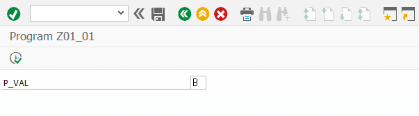
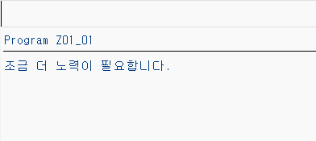

```abap
*&---------------------------------------------------------------------*
*& Report Z01_01
*&---------------------------------------------------------------------*
*&
*&---------------------------------------------------------------------*
REPORT Z01_01.


PARAMETERS: p_val TYPE c LENGTH 2.

CASE p_val.
  WHEN 'A+' or 'A'.
    WRITE: '최고 점수입니다.'.
  WHEN 'B'.
    WRITE: '조금 더 노력이 필요합니다.'.
  WHEN 'C'.
    WRITE: '분발해야 합니다.'.
  WHEN OTHERS.
    WRITE: '올바르지 않은 학점입니다.'.
ENDCASE.
```
<br><br>
```abap
*&---------------------------------------------------------------------*
*& Report Z01_01
*&---------------------------------------------------------------------*
*&
*&---------------------------------------------------------------------*
REPORT Z01_01.


PARAMETERS: p_val TYPE c LENGTH 2.

DATA(gv_text) = SWITCH string( p_val
                  WHEN 'A+' or 'A'  THEN '최고 점수입니다.'
                  WHEN 'B'  THEN '조금 더 노력이 필요합니다.'
                  WHEN 'B'  THEN '분발해야 합니다.'
                  ELSE '올바르지 않은 학점입니다.'
                ).

WRITE: gv_text.
```

<br>

