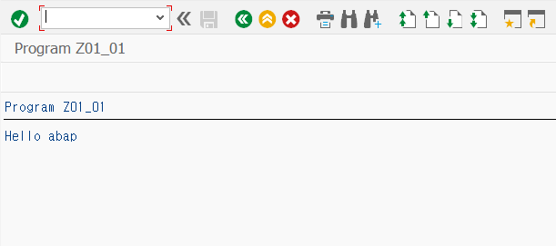
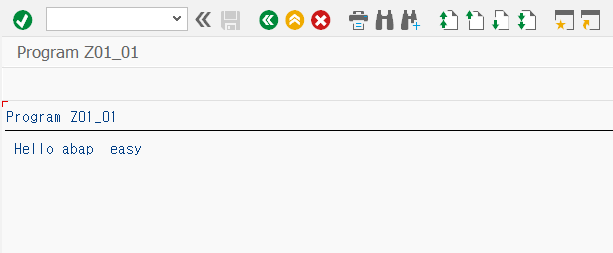

```abap
*&---------------------------------------------------------------------*
*& Report Z01_01
*&---------------------------------------------------------------------*
*&
*&---------------------------------------------------------------------*
REPORT Z01_01.


* 공백으로 연결된 ABAP 텍스트 문자열은 연결.
DATA: gv_val TYPE c LENGTH 20.

DATA(gv_val1) = 'abap'.
CONCATENATE 'Hello ' gv_val1 INTO gv_val SEPARATED BY space.

WRITE: / gv_val.
```



<br>

```abap
*&---------------------------------------------------------------------*
*& Report Z01_01
*&---------------------------------------------------------------------*
*&
*&---------------------------------------------------------------------*
REPORT Z01_01.


* 공백으로 연결된 ABAP 텍스트 문자열은 연결.
DATA: gv_val TYPE c LENGTH 20.

DATA(gv_val1) = 'abap'.
gv_val = | Hello { gv_val1 } |.  " { } 안에 변수를 넣는다.

WRITE: / gv_val.
```


<br>

```abap
*&---------------------------------------------------------------------*
*& Report Z01_01
*&---------------------------------------------------------------------*
*&
*&---------------------------------------------------------------------*
REPORT Z01_01.


* 공백으로 연결된 ABAP 텍스트 문자열은 연결.
DATA: gv_val TYPE c LENGTH 20.

DATA(gv_val1) = 'abap'.

* 여러 개의 템플릿 문자열을 연결하려면 & 기호 사용.
gv_val = | Hello | & | { gv_val1 } |.   " { } 안에 변수를 넣는다.

WRITE: / gv_val.
```


<br>

```abap
*&---------------------------------------------------------------------*
*& Report Z01_01
*&---------------------------------------------------------------------*
*&
*&---------------------------------------------------------------------*
REPORT Z01_01.


* 공백으로 연결된 ABAP 텍스트 문자열은 연결.
DATA: gv_val TYPE c LENGTH 20.

DATA(gv_val1) = 'abap'.
DATA(gv_val2) = 'easy'.

* 여러 개의 템플릿 문자열을 연결하려면 & 기호 사용.
gv_val = | Hello { gv_val1 } | & | { gv_val2 } |.

WRITE: / gv_val.
```




<br>

```abap
*&---------------------------------------------------------------------*
*& Report Z01_01
*&---------------------------------------------------------------------*
*&
*&---------------------------------------------------------------------*
REPORT Z01_01.


DATA: gv_val TYPE c.

gv_val = | \| |.    " 특수문자 |를 출력하려면 \(역슬러쉬) 사용.

WRITE: / gv_val.
```


<br>


