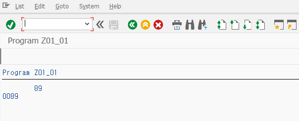
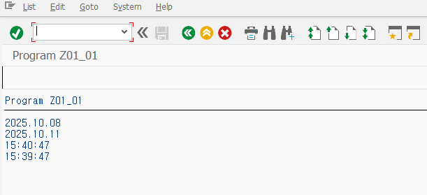

```abap
*&---------------------------------------------------------------------*
*& Report Z01_01
*&---------------------------------------------------------------------*
*&
*&---------------------------------------------------------------------*
REPORT Z01_01.


DATA: gv_num1 TYPE i.           " TYPE i를 선언하면 변수 자리수 만큼 출력
DATA: gv_num2 TYPE n LENGTH 4.  " TYPE i으로 선언하면 변수에서 공백은 0으로 표현되어 문자 길이만큼 LIST에 조회된다.

gv_num1 = 89.
WRITE: / gv_num1.

gv_num2 = 89.
WRITE: / gv_num2.
```


<br>

```abap
*&---------------------------------------------------------------------*
*& Report Z01_01
*&---------------------------------------------------------------------*
*&
*&---------------------------------------------------------------------*
REPORT Z01_01.


* 날짜 타입 변수를 선언하여 sy-datum 값을 할당한다.
DATA(gv_date) = sy-datum.   " 시스템 변수. 오늘 날짜
WRITE: / gv_date.

* 날짜 타입 변수에 숫자를 더하면 일(Day) 단위로 계산.
gv_date = gv_date + 3.
WRITE: / gv_date.

* 시간 타입 변수를 선언하여 sy-uzeit 값을 할당한다.
DATA(gv_time) = sy-uzeit.   " 시스템 변수. 현재 시간
WRITE: / gv_time.

* 시간 타입 변수에 연산을 수행하면 초(second) 단위로 계산된다.
gv_time = gv_time - 60.
WRITE: / gv_time.
```



<br>

